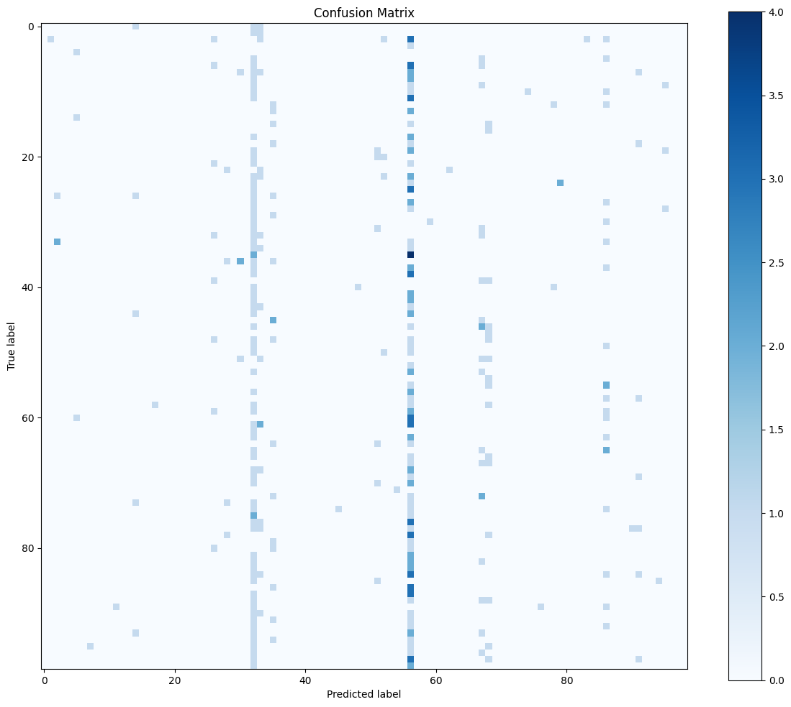
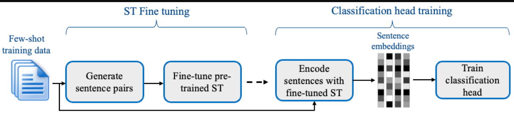
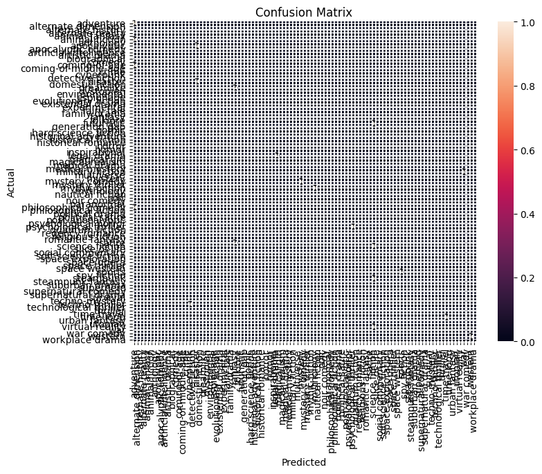
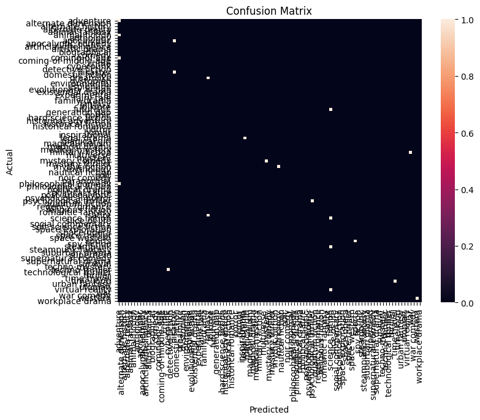
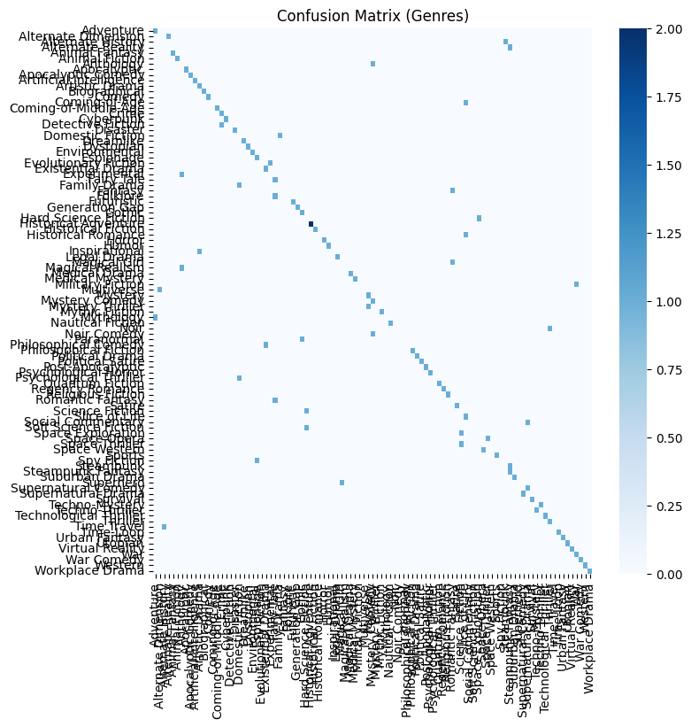

# Genre Classification

## Objective
The aim of this task is to **build a model that can accurately classify stories into their respective genres** while preserving the question-answering performance from Task 1 if the same LLM is used.  
This requires **smart multi-task design, careful resource management, and handling subtle distinctions between similar or overlapping genres**.

---

## Main Challenges

1. **GPU Memory Limitations**
   - Training is constrained by a **T4 GPU with 15GB VRAM** (Google Colab).  
   - Limited memory necessitated **smaller batch sizes and fewer training epochs**, requiring careful balancing between learning efficiency and model stability.  
   - Efficient use of **lightweight embeddings** and optimized model fine-tuning was critical.

2. **Sparse Data per Genre**
   - The dataset contains **1,000 stories across 100 genres**, resulting in **roughly 10 examples per genre** for most classes.  
   - This scarcity makes the model prone to **overfitting** and requires **thoughtful preprocessing and potential data augmentation**.

3. **Highly Similar / Overlapping Genres**
   - Many genres are closely related, creating **ambiguity and classification difficulty**.  
   - Examples include:

   **Alternate / Reality Themes**  
   - Alternate Dimension , Alternate History , Alternate Reality 

   **Animal Themes**  
   - Animal Fantasy , Animal Fiction 

   **Apocalyptic / Post-Apocalyptic**  
   - Apocalyptic , Apocalyptic Comedy , Post-Apocalyptic 

   **Comedy Variants**  
   - Comedy , Apocalyptic Comedy , Mystery Comedy , Noir Comedy , Philosophical Comedy , Supernatural Comedy , War Comedy.

   **Fantasy Variants**  
   - Fairy Tale , Fantasy , Futuristic , Magical Girl , Magical Realism , Mythic Fiction , Romantic Fantasy , Steampunk Fantasy , Urban Fantasy , Virtual Reality

   **Mystery / Thriller Variants**  
   - Detective Fiction , Mystery , Mystery Comedy , Mystery Thriller , Techno-Mystery , Techno-Thriller , Technological Thriller , Thriller

   - These overlaps make it essential to **design a classifier that can capture subtle differences** and **avoid confusion between related genres**.

4. **Maintaining Multi-Task Performance**
   - Fine-tuning the LLM for classification must **not compromise the retrieval or QA abilities** from Task 1.  
   - With limited epochs and overlapping genres, the **training schedule and hyperparameter selection** must carefully balance multi-task objectives.

---
## Data Preprocessing & Augmentation

### 🔹 Data Cleaning
Before training, the story dataset was cleaned to ensure consistency and reliability:  
- **Lowercased** all text for standardization.  
- **Removed special characters, extra spaces, and non-alphanumeric symbols**.  
### 🔹 Data Augmentation
Since each genre originally had only **~10 stories**, we expanded the dataset using several strategies:

#### 1. Chunking (Initial Approach)
- Stories were split into smaller chunks to increase data size.  
- **Observation:** Chunking increased overlap between similar genres and did **not** improve classifier performance.  

#### 2. Paraphrase Generation
- LLMs were used to **paraphrase existing stories**, creating variations with the same meaning.  
- Roughly **400 additional examples** were generated.  
- Benefits:  
  - Preserves **semantic content**.  
  - Adds **syntactic diversity**, improving generalization.  

#### 3. Synthetic Story Generation
- Additional stories were created using multiple LLM providers to further **augment the dataset**.  
- Roughly **400 examples** were generated in this way.  
- Helps to cover **underrepresented genres** and reduces confusion among overlapping or similar genres.  
- Ensures the classifier can **better distinguish nuanced genres**.

### 🔹 Summary of Preprocessing Pipeline
1. **Cleaned** all story text and metadata.  
2. **Chunked** stories initially, but found it ineffective.  
3. **Generated ~400 paraphrased examples** using LLMs.  
4. **Generated ~400 synthetic stories** using LLM providers.  
5. The resulting dataset is **expanded, semantically diverse, and balanced**, making it suitable for training a high-performing genre classifier under GPU constraints.
---
## Methodology & Model Approaches

### **Baseline Performance**
Before training, a baseline classifier on raw data achieved:
```text
=== TEST RESULTS ===
Accuracy : 0.0113
Precision: 0.0007
Recall   : 0.0113
F1 score : 0.0013
```


*Confusion matrix before training:*  



#### **Approach 1: Classification Head on LLM Embeddings**

- **Concept:** Treat the causal LLM (Qwen 1.5B-Instruct from Task 1) as an **encoder**.  
- **Process:**  
  1. Input text is passed through the LLM.  
  2. Extract the **final token’s embedding** as a representation of the full text.  
  3. Feed this embedding into a **small classification head** (linear or two-layer feed-forward).  
- **Advantages:**  
  - Leverages the LLM’s contextual understanding.  
  - Simple to implement with minimal additional parameters.  
- **Limitations:**  
  - Performance may be constrained by **limited labeled examples**.  
  - Last-token embedding may not capture nuanced distinctions in very long stories.  


#### **Approach 2: Instruction-Tuning LLM for Classification**

- **Concept:** Frame genre classification as an **instruction-following problem**.  
- **Process:**  
  1. Each story + genre label is converted into a prompt → answer pair:  

     ```
     Text: <story>
     Question: What is the genre of the above text?
     Answer: <genre>
     ```
  2. Fine-tune the LLM to generate the correct genre given a prompt.  
  3. Apply **LoRA adapters (r=32)**. 
- **Advantages:**  
  - Treats classification as a **natural language task**, leveraging LLM generation capabilities.  
  - Instruction tuning can generalize better to unseen text.  
- **Limitations:**  
  - Model may produce extra explanatory text if not properly constrained.  
  - Requires careful prompt design to maintain consistency.

#### **Approach 3: SetFit for Few-Shot Classification**

- **Concept:** Efficient **few-shot learning** on top of **sentence embeddings**.  
- **Process:**  
  1. **Embedding Model:** `sentence-transformers/paraphrase-mpnet-base-v2`.  
  2. **Training Data Sampling:** Construct **positive and negative sentence pairs** based on in-class/out-of-class examples.  
  3. **Fine-Tuning:** Update embeddings based on the generated pairs.  
  4. **Classification Head:** Train a simple classifier on top of the fine-tuned embeddings.  
- **Advantages:**  
  - Requires **very few labeled examples**.  
  - Highly efficient in both memory and compute.  
- **Limitations:**  
  - Might underperform on extremely fine-grained genres.  
  - Quality depends on embedding space separation.  



### 🔹 Summary of Methodology

- **Two main paradigms:** LLM-based embeddings + classification head and LLM instruction-tuning for text generation.  
- **SetFit** provides an efficient few-shot alternative using sentence embeddings.  
- **Data augmentation** via Groq and paraphrasing mitigates class imbalance and small dataset issues.  
---
## Training Methodology

Due to limited GPU memory and the small size of the dataset, we adopted parameter-efficient and few-shot training strategies instead of full fine-tuning. All LLM-based approaches were trained for **3 epochs**.

We explored three different training strategies:

1. LLM + Classification Head  
2. Instruction-Tuning  
3. SetFit (Contrastive Few-Shot Learning)  

### 1️⃣ LLM + Classification Head

In this approach, the language model is used as a contextual encoder.  
The final hidden representation is passed into a lightweight classification head to predict one of the 100 genres.

The model is loaded as a **sequence classification model**.

### LoRA Configuration

```python
lora_config = LoraConfig(
    r = 32,
    lora_alpha = 8,
    target_modules = ['q_proj', 'k_proj', 'v_proj', 'o_proj'],
    lora_dropout = 0.05,
    bias = 'none',
    task_type = 'SEQ_CLS'
)

```
### Design Justification

- **r = 32** → Provides sufficient adaptation capacity while remaining memory-efficient.  
- **lora_alpha = 8** → Controls the scaling of LoRA updates to stabilize training.  
- **Targeting attention projections (q, k, v, o)** → These layers are the most impactful for contextual adaptation.  
- **lora_dropout = 0.05** → Reduces overfitting in a low-data setting.  
- **bias = none** → Keeps training lightweight and focused on attention adaptation.  

Only the LoRA parameters and classification head are trained, while the base model remains frozen.

**Training duration:** 3 epochs  

### Instruction-Tuning Approach

In this approach, genre classification is reformulated as a text generation task.

Instead of using a classification head, the model receives a structured prompt:
```text
  ### Instruction:
    "Classify the genre of this story."
  ### Input:
    {example['story_processed']}
  ###
     Response:
      {example['genre']}"
```

The model is loaded as a causal language model (`CAUSAL_LM`) and trained to predict the genre as the next tokens.

**LoRA Configuration:**

```python
from peft import LoraConfig

lora_config = LoraConfig(
    r = 32,
    lora_alpha = 8,
    target_modules = ['q_proj', 'k_proj', 'v_proj', 'o_proj'],
    lora_dropout = 0.05,
    bias = 'none',
    task_type = 'CAUSAL_LM'
)
```
### Key Differences from Classification Head

- Task type changed to **CAUSAL_LM**
- Loss computed over generated tokens
- No external classification head
- Prediction relies entirely on generative modeling

## Why This Approach

- Aligns with the original next-token training objective of LLMs
- Enables reasoning before prediction
- Maintains parameter efficiency through LoRA
- Preserves pretrained language modeling behavior

**Training duration:** 3 epochs


### SetFit (Few-Shot Contrastive Learning)

Due to extreme data scarcity (~10 samples per genre), SetFit was used for few-shot classification.

Instead of fine-tuning a large LLM, a sentence transformer is trained using contrastive learning over sentence pairs.

## Training Hyperparameters

```python
num_iterations = 10
num_epochs = 2
batch_size = 8
learning_rate = 2e-5
```
### Design Justification

- `num_iterations = 10` → Generates multiple positive and negative pairs per example to increase supervision signals.
- `num_epochs = 2` → Prevents overfitting while maintaining training stability.
- `batch_size = 8` → Selected to operate within memory constraints.
- `learning_rate = 2e-5` → Standard stable learning rate for transformer-based encoders.

### Why SetFit

- Designed for low-resource scenarios
- Uses sentence-pair contrastive learning
- Generates richer supervision from limited data
- Requires significantly less memory
- More stable under small dataset conditions

---
## 	Evaluation Metrics & Performance

We evaluated the performance of our models across **pre-training baseline**, **LLM + Classification Head**, **Instruction-Tuning**, and **SetFit** approaches. Metrics include Accuracy, Precision, Recall, F1 score, and confusion matrices. 
### Pre-Training Baseline
| Metric   | Value |
|----------|-------|
| Accuracy | 0.0113 |
| Precision| 0.0007 |
| Recall   | 0.0113 |
| F1 Score | 0.0013 |

**Confusion Matrix Example**  

  
*Illustrates which genres were most frequently confused before training.*
> **Observation:** Baseline shows that almost all predictions failed to match the correct genres, highlighting the difficulty of classifying **100 overlapping classes with very few samples**.

### LLM + Classification Head

After applying **LoRA with a lightweight classification head** on top of the LLM, performance improved significantly compared to baseline.

| Metric   | Value |
|----------|-------|
| Accuracy | 0.0737 |
| Precision| 0.0595 |
| Recall   | 0.0737 |
| F1 Score | 0.0573 |

**Confusion Matrix Example**  

  

**Training Time:** 27:32 (min:sec)

> **Commentary:** Accuracy increased from 0.01 → 0.07 after fine-tuning and data augmentation. While better, the results remain low due to:  
> - **Limited data per class (less than ~18 samples after augmentation)**  
> - **High overlap between genres**, making it difficult for the model to distinguish subtle differences  
> - **Many classes are semantically similar**, e.g., *Alternate Dimension*, *Alternate Reality*, *Alternate History*  
>
> Fine-tuning with LoRA allows parameter-efficient learning but cannot fully overcome the inherent scarcity and complexity.

### instruction-Tuning Approach

This method reframes classification as a **causal text generation problem** using structured prompts:

The LLM autoregressively generates the genre label.

| Metric   | Value |
|----------|-------|
| Accuracy | 0.07 |
| Precision| 0.05 |
| Recall   | 0.07 |
| F1 Score | 0.0547 |

**Confusion Matrix Example**  

  

**Training Time:** 42:42 (min:sec)

> **Commentary:**  
> - Accuracy is similar to classification head, but slightly lower precision and F1.  
> - Half of the generated outputs are **not perfectly aligned with the prompt** due to extremely limited data.  
> - Instruction-tuning allows the model to follow a generative framework, but the small dataset limits its ability to generalize across 100 genres.  
> - LoRA ensures parameter efficiency but cannot compensate fully for data scarcity.  

### SetFit (Few-Shot Contrastive Learning)

SetFit leverages **sentence-pair contrastive learning** on a **sentence-transformer** instead of a full LLM. It is particularly effective in **few-shot scenarios** (~10 samples per genre).


| Metric   | Value |
|----------|-------|
| Accuracy | 0.58 |
| Precision| 0.5083 |
| Recall   | 0.58 |
| F1 Score | 0.53 |

**Confusion Matrix Example**  

 
> **Commentary:**  
> - SetFit achieved **the best metrics**, significantly outperforming LLM-based approaches.  
> - Contrastive learning generates multiple positive/negative pairs per example, effectively **increasing supervision** from the limited dataset.  
> - Memory-efficient and stable even with small training data.  
> - Based on these results, **SetFit is selected as the final model** for genre classification.
### Summary of Results
#### Data Scarcity
- Each genre only has about **10–14 examples**, making it extremely difficult for the models to learn robust patterns.  
- Limited samples lead to **high variance in model performance**, especially for LLM-based fine-tuning methods.  

#### Genre Overlap
- Many genres are **closely related or partially overlapping**, which increases classification difficulty.  
- Examples of overlapping genres:  
  - **Alternate / Reality Themes:** Alternate Dimension, Alternate History, Alternate Reality  
  - **Animal Themes:** Animal Fantasy, Animal Fiction  
  - **Apocalyptic / Post-Apocalyptic:** Apocalyptic, Apocalyptic Comedy, Post-Apocalyptic  
  - **Comedy Variants:** Comedy, Apocalyptic Comedy, Mystery Comedy, Noir Comedy, Supernatural Comedy  
  - **Fantasy Variants:** Fairy Tale, Fantasy, Futuristic, Magical Girl, Magical Realism, Mythic Fiction, Romantic Fantasy, Steampunk Fantasy, Urban Fantasy, Virtual Reality  
  - **Mystery / Thriller Variants:** Detective Fiction, Mystery, Mystery Comedy, Mystery Thriller, Techno-Mystery, Techno-Thriller, Technological Thriller, Thriller  

#### Implications
- Overlap between genres causes **confusion during classification**, as similar textual patterns may appear in multiple labels.  
- Small dataset sizes amplify this effect, making **few-shot learning and data augmentation essential**.  

#### Approach Justification
- Despite aggressive data augmentation via paraphrasing and synthetic generation, LLM-based methods (Classification Head, Instruction-Tuning) still struggle to reach high accuracy due to **extreme class imbalance and semantic overlap**.  
- **SetFit** mitigates some of these issues by using **contrastive learning on sentence pairs**, which effectively increases the training signal and improves classification for overlapping or low-resource genres.  

> **Takeaway:**  
> Achieving high accuracy in this multi-class, highly overlapping genre classification task is inherently challenging. Data augmentation, few-shot methods, and contrastive training are critical for improving model performance under these constraints.
## Final Summary

### System Performance
- The project uses **two main models**: the RAG retrieval-augmented model and the SetFit classifier.  
- Both models are **efficient and lightweight**:  
  - RAG system runs under ~10 GB VRAM.  
  - SetFit genre classifier runs under ~2.5 GB VRAM.  
- This ensures the full system can run comfortably **within a 24 GB VRAM constraint**, leaving room for multi-task operations or expansion.

### Lessons Learned
- **Data limitations** were the primary bottleneck: only 10–14 examples per genre, with high overlap between many categories.  
- **Few-shot and contrastive learning methods** (like SetFit) are essential for improving performance under these constraints.  
- **Data augmentation** via paraphrasing and synthetic generation improved the training signal, but was limited by token constraints of free LLM models.  

### Future Improvements
- **More data and synthetic generation** could significantly boost classification and retrieval accuracy.  
- **Larger GPU resources** would allow increasing hyperparameters and training duration, improving fine-tuning effectiveness.  
- Incorporating additional **high-quality embeddings and LLMs** for both RAG and classification tasks would strengthen the overall system.  


