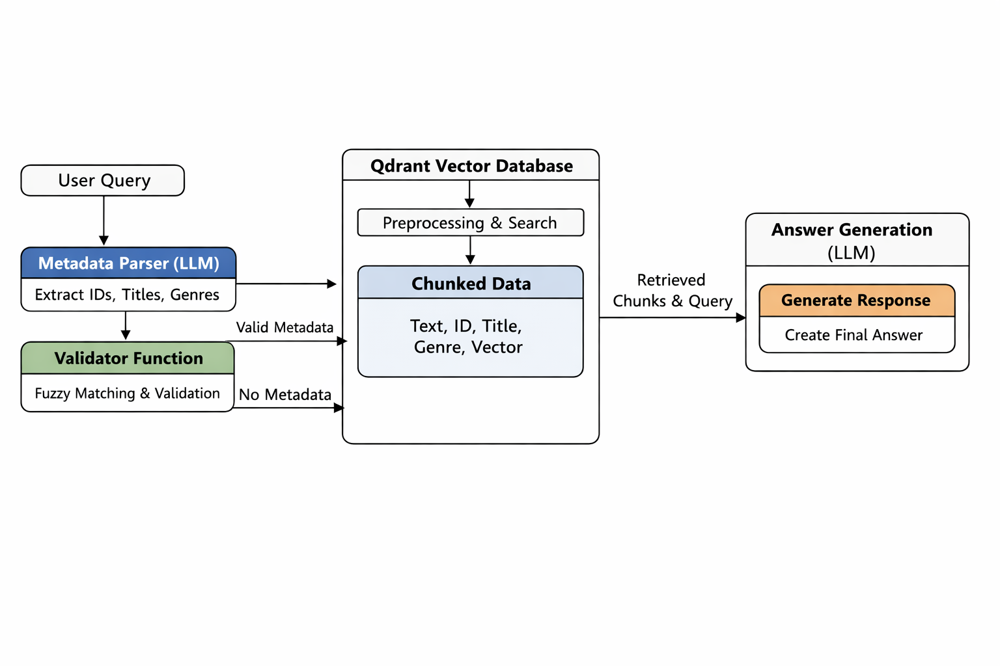
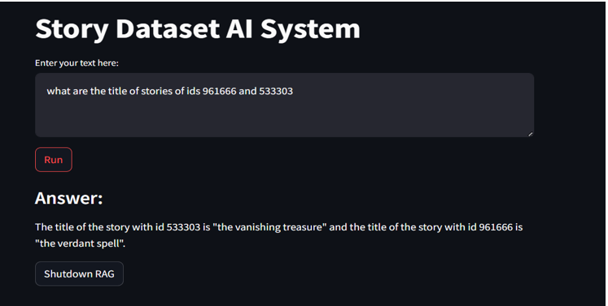
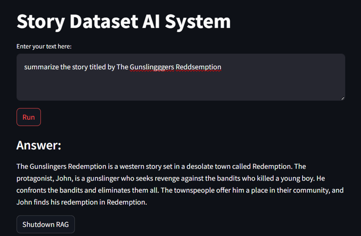
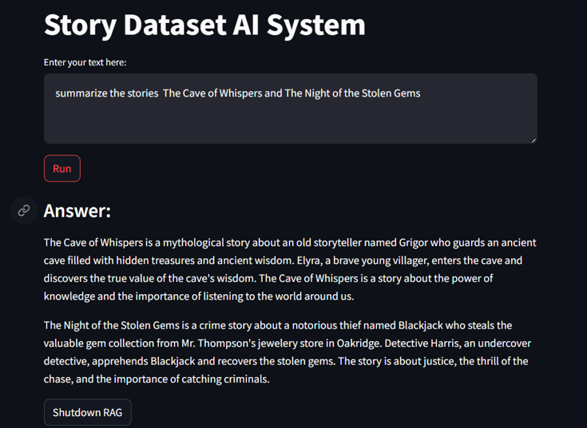
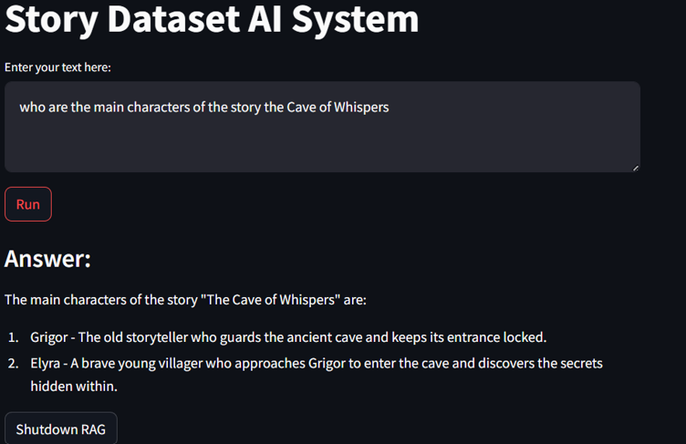
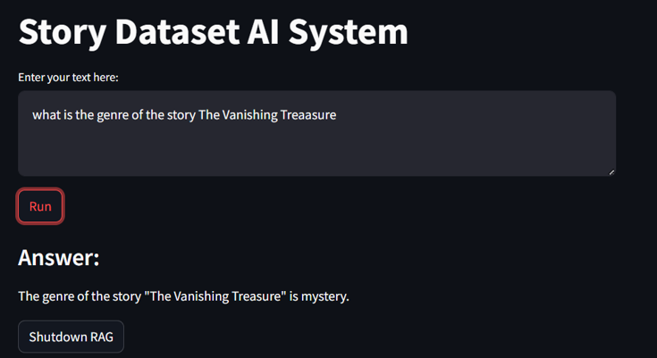

# Story Retrieval Chatbot
## Overview

The objective of this module is to design a robust and well-structured Retrieval-Augmented Generation (RAG) system that goes beyond simple content matching. The system is not limited to retrieving text passages based only on semantic similarity; instead, it is designed to intelligently extract relevant information from user queries and handle different types of requests in a structured and adaptive manner.

Queries can vary significantly — for example:

- Requests about a specific story ID  
- Questions targeting a particular genre  
- Thematic searches (e.g., friendship, adventure, betrayal)  
- Plot-specific or character-specific questions  
- Summary or explanation requests  

To handle this diversity, the system extracts key elements from the query to guide retrieval. Depending on the extracted information, it can:

- Apply metadata filtering (e.g., genre, story ID, title)  
- Perform semantic similarity search over story chunks  
- Construct task-specific prompts for the language model  

This approach ensures the RAG system is both content-aware and task-aware. By combining extraction from the query, structured metadata filtering, and semantic retrieval, the system delivers responses that are accurate, relevant, and grounded in the actual dataset.

The architecture is designed to be modular, scalable, and efficient under the 24GB VRAM constraint, while remaining suitable for optimized CPU deployment.

---
## Architecture Design


The RAG system is designed to handle user queries efficiently while grounding answers in the actual dataset. The architecture can be summarized in the following steps:

1. **User Query Input**
   - The system receives a natural language query from the user.

2. **Metadata Extraction**
   - A dedicated LLM acts as a **metadata parser**.
   - Extracts potential fields from the query:  
     ```json
     { "id": [], "genre": [], "title": [] }
     ```
   - Returns `None` for fields not found.

3. **Validation of Extracted Metadata**
   - A validator function checks whether each extracted field exists in the dataset.
   - Fuzzy search is applied to account for approximate matches.
   - Fields below a similarity threshold are ignored; others are retained.

4. **Vector Database Retrieval**
   - The validated metadata and original query are sent to **Qdrant**.
   - Preprocessing is applied on the query and dataset points.
   - Dataset is stored as **chunks**, each with:
     - Vector representation
     - Payload: `[text, id, title, genre]`
   - Qdrant retrieves the most relevant chunks based on similarity and metadata filters.

5. **Answer Generation**
   - The retrieved chunks, along with the original query, are passed to a second LLM.
   - The model generates the final answer grounded in the retrieved context.

6. **Output**
   - The system returns the answer to the user.

---

## Model Selection & Justification

Selecting the right language model for the RAG system is critical due to the **24 GB VRAM constraint** shared between retrieval and classification tasks. We evaluated several options, including **google/gemma-2b**, **LLaMA 2 7B**, and **Qwen2.5‑1.5B‑Instruct**. After comparing quality, size, and resource requirements, we selected **Qwen2.5‑1.5B‑Instruct** as the best balance of performance and efficiency.

### Model Comparison (Verified Hugging Face Details)

### Model Comparison: Instruction‑Tuned Versions (Verified Hugging Face Info)

| Model | Parameters | Approx. Size (full weights) | Training Data | Context Window | Strengths | Weaknesses |
|-------|------------|-----------------------------|---------------|----------------|-----------|------------|
| **Qwen2.5‑1.5B‑Instruct** | ~1.54B | ~3.1 GB (full fp16/BF16) | Instruction‑tuned version of Qwen2.5 family trained on large multilingual web corpora with instruction datasets for structured output & long text; supports 29+ languages.  | **32,768 tokens**  | ✔ Very efficient VRAM & disk usage<br>✔ Excellent long context support<br>✔ Strong instruction following optimized for QA | ✘ Smaller capacity compared to larger models |
| **LLaMA‑2‑7B‑Chat** | ~7B | ~12–15 GB † | Pretrained on ~2 T tokens publicly available web data, then fine‑tuned with supervised chat/instruction data & RLHF for assistant‑style use.  | ~4,096 tokens  | ✔ Strong general language + conversational performance<br>✔ Fine‑tuned on extensive human chat/instruction data | ✘ Larger model size<br>✘ Shorter context compared to Qwen |
| **Gemma‑2B‑Instruct** | ~2B (est) | ~4–6 GB (est) | Instruction‑tuned compact model trained on diverse web/structured datasets with SFT for conversational and general tasks (exact HF metrics vary).  | ~8,192 tokens  | ✔ Efficient inference<br>✔ Better context than LLaMA‑2‑Chat | ✘ Larger size than Qwen2.5<br>✘ Less multilingual training detail given |
#### Why Qwen2.5‑1.5B‑Instruct

- **Efficient Size:** With ~1.5 billion parameters, this model fits comfortably within a constrained memory environment, leaving headroom for embedding, retrieval, and classification tasks without exceeding the 24 GB VRAM limit.   
- **Instruction‑Tuned:** The instruct variant is specifically optimized for following user prompts and producing high‑quality natural responses, making it suitable for a retrieval‑augmented chatbot. 
- **Long Context Window:** Qwen’s architecture supports extended context handling (up to ~32 k tokens), enabling better integration of retrieved chunks and longer story passage reasoning.  
- **Balanced Trade‑off:** It strikes a **practical compromise** between inference quality, speed, and resource usage — ideals for an architecture combining retrieval with generation.

---

##  Data Preprocessing & Embedding Strategy
To build an effective retrieval system, we preprocess text and encode it into vectors that capture semantic meaning. This section explains how we clean and chunk the data, which embedding model we chose, and why.

### 🔹 Data Cleaning
Before embedding, we apply basic text cleaning to ensure consistent representation and accurate semantic search:
1. **Remove special characters** and punctuation to reduce noise.
2. **Lowercase all text** so that comparisons are uniform.
3. This improves filtering during metadata extraction and helps the vector model focus on semantic content, not formatting variations.

### 🔹 Chunking Strategy
We split stories into smaller paragraphs using **LangChain’s Recursive Character Text Splitter**, which:
- Ensures chunks maintain **context continuity** rather than arbitrary breaks.
- Produces logically coherent pieces (e.g.paragraphs) instead of fixed character slices.
- Prevents loss of meaning across chunk boundaries, improving retrieval relevance.

### 🔹 Embedding Model Comparison

| Embedding Model | Dimensionality | Performance/Quality | Notes |
|-----------------|----------------|----------------------|-------|
| **intfloat/e5-small** | 384 | Balanced quality and efficiency | Good trade-off between retrieval quality and speed; used in this project |
| **sentence-transformers/all-MiniLM-L6-v2** | 384 | Fast, efficient | Lightweight and very fast; slightly lower retrieval quality on hard semantic matches  |
| **BAAI/bge-base-en-v1.5** | 768 | Higher retrieval quality | Often performs better on diverse content and semantic richness  |

**Why we chose `intfloat/e5-small`:**
- **Good balance of semantic quality, speed, and dimension size:** It produces quality embeddings while remaining efficient in storage and computation, which is important for real-time retrieval.
- **Compatible with chunk size and embedding pipeline:** The 384‑dim vectors are compact enough to index and search quickly in Qdrant without excessive memory overhead.
- **Strong performance for RAG tasks at small to medium scale:** Models in the E5 family are known to generalize well across varied text types. 
---
## Vector Database & Retrieval Strategy

### 🔹 Vector Database Comparison

We evaluated several vector database options:

| Database | Strengths | Weaknesses |
|----------|-----------|------------|
| **Weaviate** | Built-in hybrid search and metadata modules | Slightly complex to deploy; performance varies with backend |
| **Milvus** | Highly scalable, supports HNSW and other indexes | Metadata filtering less flexible for complex queries |
| **Pinecone** | Managed service, easy API | Paid service; less control over index internals |
| **Qdrant** | Hybrid search + HNSW, fast ANN search, flexible metadata filtering, open-source | Requires self-hosting; documentation less extensive |

**Why Qdrant:**  
- Supports **hybrid search** combining **vector similarity** and **metadata filtering**.  
- Uses **HNSW (Hierarchical Navigable Small World) graphs** for fast approximate nearest neighbor search.  
- Efficient for high-dimensional embeddings and large datasets.  
- Flexible metadata filtering allows hybrid queries on multiple keys.

### 🔹 Collection Schema

Each chunk stored in Qdrant includes:

| Field | Description |
|-------|-------------|
| `id` | Unique story identifier |
| `title` | Story title |
| `genre` | Story genre |
| `text` | Chunk text content |
| `vector` | Embedding vector (from `intfloat/e5-small`) |

**Metadata Filtering Example:**

```python
from qdrant_client.models import FieldCondition, MatchAny

# Filter multiple acceptable values
FieldCondition(
    key="genre",
    match=MatchAny(any=["Fantasy", "Science Fiction"])
)

```
### 🔹 Metadata Extraction & Validation

- **LLM-assisted extraction** parses metadata fields (`id`, `title`, `genre`) from user queries.  
- Extracted metadata is **validated** against the dataset.  
- **Supports multiple keys for the same value** using Qdrant's `MatchAny`, allowing flexible filtering across different fields.  
- **Fuzzy search** handles typos or near matches:  
  - Small errors are tolerated while maintaining precision.  
  - Threshold is set to balance tolerance and accuracy.  
- Ensures hybrid queries work even with minor spelling mistakes or inconsistencies.
### 🔹 Query Processing & Retrieval

1. **User Query → Metadata Extraction**  
   - LLM parses relevant fields from the user query.  
   - Validation + fuzzy search corrects minor errors.  
   - Multiple keys for the same value are handled via `MatchAny`.

2. **Vector Search + Metadata Filtering**  
   - Qdrant retrieves chunks using metadata filters (`id`, `title`, `genre`, etc.) and it considered as the pre-filtering step before sematic search.  
   - Top-K most similar chunks are selected using **cosine similarity**.

3. **Prompt Construction for LLM**  
   - Retrieved chunks from Qdrant are combined with the original user query to form the input prompt.  
   - The prompt is carefully designed to give the LLM **strict instructions**, ensuring it only answers based on the provided context and the user’s query.  
   - The LLM is explicitly instructed to maintain **high relevance**, meaning the answer must directly reflect the content of the retrieved chunks and the intent of the query.  
   - If no sufficient or relevant information is found in the context, the LLM is instructed to respond with **“I don’t know”** or a similar statement, rather than generating speculative or unrelated information.  
   - This approach reduces hallucinations and ensures that responses are **trustworthy and context-aware**, while still allowing flexibility in phrasing and explanation within the bounds of the retrieved information.

##  Memory & Resource Usage

- **VRAM Usage:**  
  - Using `nvidia-smi`, we monitored GPU memory while running the full system, including:  
    - LLM (Qwen2.5-1.5B)  
    - Embedding model (`intfloat/e5-small`)  
    - Retrieval pipeline and Qdrant interactions  
    - Chunk processing and prompt construction  
  - The total VRAM usage **does not exceed ~10 GB**, keeping the system well within the **24 GB combined constraint** for retrieval and classification tasks. 
  - **Why it fits inside 24GB:**  
  - **Balanced system design** ensures all components are memory-efficient:  
    - **LLM (Qwen2.5-1.5B)** is small enough to generate high-quality responses without exceeding VRAM limits.  
    - **Embedding model (`intfloat/e5-small`)** is compact, with fast vector generation and low memory footprint.  
    - **Qdrant vector database** efficiently handles storage and HNSW-based retrieval, only loading required vectors per query.  
    - **Top-K selection and prompt construction** prevent unnecessary context from being loaded, keeping memory usage controlled.  

- **Trade-offs:**  
  - Prioritizing **lightweight models, embeddings, and retrieval strategies** allows the system to maintain high accuracy while staying within strict memory limits.  
  - Some latency is introduced due to batch processing and vector retrieval, but this is balanced against **robustness, accuracy, and retrieval quality**.
---
## LLM Evaluation Methodology & Example Queries
### 🔹 Evaluation Method

- We used **LLM as a judge**: `LLaMA-3.3-70B-Versatile` from Groq to evaluate system answers.  
- **ChatGPT** was used to generate detailed questions and reference answers.  
- A subset of responses was **reviewed by humans** for quality validation.  
- Evaluation focused on: relevance, correctness, and strict adherence to retrieved context.

### 🔹 Example Queries

#### 1. Genre-Based Questions
- Tell me about stories in the science fiction genre.  
- Show me some romance stories from the dataset.  
- What horror stories are available?  
- Find me a fantasy story involving magic or mythical creatures.  
- Are there any mystery stories with detectives or investigations?  
- Give me a story from the adventure genre.  
- Show me a story that belongs to the thriller genre.  

#### 2. Content-Based Questions
- Find me a story about adventure and friendship.  
- Is there a story involving space travel and aliens?  
- Give me a story that focuses on betrayal and revenge.  
- Which story talks about survival in a dangerous environment?  

#### 3. Title-Based Questions
- Summarize the story titled *Eldoria’s Enchanted Whispers*.  
- What genre is the story titled *Echoes of Whispered Shadows*?  
- What is the main conflict in the story *The Quest for the Lost Treasure of Avarice*?  
- Who are the main characters in *The Chronicles of the Cosmic Rift*?  
- Give a brief summary of the story *Survivors of the Fallen World*.  

#### 4. ID-Based Questions
- What is the story with ID 457,580 about?  
- Summarize the story with ID 297,904.  
- What genre does the story with ID 123,456 belong to?

### 🔹 Key Points

- Queries cover **all types of user requests**: genre search, content-specific queries, title references, and ID lookups.  
- **LLM responses** are evaluated for:  
  - Accuracy: answers match the story content.  
  - Relevance: responses strictly adhere to the retrieved context.  
  - Completeness: sufficient detail without hallucinations.  
- **Human validation** ensures evaluation metrics align with practical expectations.  
- This structured evaluation allows measuring the system’s **performance across retrieval, LLM reasoning, and prompt effectiveness**.
### 🔹 LLM Evaluation Examples

| Question | RAG Answer | Ground Truth | Evaluation (Score & Reasoning) |
|----------|------------|--------------|--------------------------------|
| Which story talks about survival in a dangerous environment? | The story "the desert escape" talks about survival in a dangerous environment. | Survivors of the Fallen World — Post-apocalyptic survivors fight scarcity and threats in a harsh landscape. Across the Frozen Wastes — Expedition members survive extreme cold and treacherous terrain. Island of the Forsaken — Shipwrecked survivors adapt to a remote island for food, shelter, and safety. The Jungle Labyrinth — Explorers get trapped in a dense jungle with predators, testing ingenuity and cooperation. Desert of Endless Sands — Caravan stranded in a vast desert, survival depends on resourcefulness and teamwork. | Score: 4 — The RAG answer is mostly correct as it mentions a story about survival in a dangerous environment, and "the desert escape" is a subset of the concept found in "Desert of Endless Sands" in the ground truth, but it lacks the variety and details of the ground truth, which includes multiple stories of survival in different environments. |
| Summarize the story titled Eldoria’s Enchanted Whispers. | Eldoria's Enchanted Whispers follows the adventures of Thorn, a young boy who inherits the Sword of Eldoria after his parents vanish mysteriously. When a powerful sorceress threatens to bring chaos to Eldoria, Thorn takes up the sword and faces his greatest challenge. Along the way, he battles various creatures and solves puzzles to reach Eldoria. In the end, he defeats the sorceress and restores peace to the kingdom. | Thorn, a young boy in the mystical realm of Eldoria, discovers a legendary sword hidden within an ancient grove. The sword gives him elemental powers, but awakening it attracts the attention of dark forces. With his grandfather’s guidance, Thorn embarks on a quest to confront the Shadow Beast. Along the way, he meets magical creatures and learns to harness his powers. The climax involves a battle in the heart of the forest, where teamwork and clever strategy are key. The story ends with Eldoria safe and Thorn beginning to train as the realm’s protector. Main Characters: Thorn, Grandfather, Shadow Beast, Forest spirits. | Score: 4.2 — The RAG answer is partially correct, capturing the essence of a young boy's adventure in Eldoria, but it misses key points such as the sword's elemental powers, the role of Thorn's grandfather, and the final battle with the Shadow Beast, introducing a sorceress instead. |
| What genre is the story titled Echoes of Whispered Shadows? | genre: mystery | Genre: Thriller / Mystery. Detective Johnathan investigates strange disappearances and supernatural phenomena in Whispering Shadows. He uncovers a network of secret organizations, faces threats, and eventually exposes the conspirators. Main Characters: Johnathan, Various townspeople, Shadowy conspirators. Main Conflict: Solving a web of mysteries while facing threats from those who wish to keep secrets hidden. | Score: 3.8 — The RAG answer is mostly correct, identifying 'mystery' as a genre, which is partially present in the ground truth, but it misses the additional 'thriller' genre and other details, although 'mystery' is a subset of the ground truth. |
| What is the main conflict in the story The Quest for the Lost Treasure of Avarice? | The main conflict in the story "The Quest for the Lost Treasure of Avarice" revolves around the search for the legendary treasure hidden by the pirate Captain Avarice. This conflict arises due to the belief that the treasure exists and the desire to uncover its location and claim its riches. The primary antagonist is the Shade of Avarice, a spectral creature guarding the treasure, which adds another layer of danger to the quest. Additionally, the rivalry between Thomas, Emily, and Jack and the treasure hunters led by Captain Rook further complicates the journey, adding tension and suspense throughout the story. | Historian Thomas discovers a centuries-old pirate map and recruits companions. They travel through ancient ruins and dangerous terrain facing traps and rival treasure hunters. The main conflict is finding the treasure before rivals while surviving the journey. Main Characters: Thomas, Navigator / Companions, Rival treasure hunters. | Score: 4.2 — The RAG answer correctly identifies the main conflict as the search for the treasure and introduces the primary antagonist and rival treasure hunters, but it includes some extra details not present in the ground truth, such as the Shade of Avarice, and slightly deviates from the core conflict of surviving the journey and beating rivals. |
## 🔹 Example RAG Answers Screenshots

### Question 1
 #### Handling different keys for the same value[id].


### Question 2
 #### Handling Keywords mistakes.


### Question 3


### Question 4


### Question 5


### Question 6


---
## Tools & Technologies Used
| Tool / Package        | Description |
|-----------------------|------------|
| Qdrant                | Vector database used to store and retrieve story embeddings for semantic search in the RAG system. |
| Pandas                | Used for loading, processing, and manipulating the story dataset efficiently. |
| LangChain             | Handles document loading, text chunking, and orchestration of the retrieval pipeline. |
| LangSmith             | Used for tracing, debugging, and monitoring LLM interactions and RAG workflows. |
| Transformers (Hugging Face) | Provides access to pretrained language models and tokenizers for both retrieval and classification tasks. |
| llama.cpp             | Enables efficient local inference of LLMs with optimized CPU performance and quantization support. |
| Groq LLM              | High-speed inference provider used to run large language models with low latency. |
---
## RAG Module Structure
```
RAG/
├── assets/
│   └── # Vector database files and created collections
│
├── helpers/
│   ├── __init__.py
│   └── config.py
│
├── models/
│   ├── __init__.py
│   │
│   ├── db_scheme/
│   │   ├── __init__.py
│   │   └── retrieveddocument.py        # RetrievedDocument Pydantic model
│   │
│   └── datapreprocessing/
│       ├── __init__.py
│       └── StoryDatasetProcessor.py    # Applies preprocessing techniques
│
├── stores/
│   ├── __init__.py
│   │
│   ├── llm/
│   │   ├── local_models/
│   │   ├── __init__.py
│   │   ├── providers/
│   │   │   ├── __init__.py
│   │   │   ├── GenerativeModels.py
│   │   │   ├── GenerativeModelsHistory.py
│   │   │   ├── embedding_models.py      # Contains E5SentenceEmbedder
│   │   │   └── quantized_model/
│   │
│   └── vectordb/
│       ├── __init__.py
│       ├── Providers/
│       │   ├── __init__.py
│       │   └── QdrantDBProvider.py      # VectorDBInterface implementation
│       ├── QdrantChunkIngestor.py       # Handles vector ingestion
│       └── VectorDBInference.py         # Provides inference methods for querying the vector DB
│
├── controllers/
│   ├── __init__.py
│   ├── RAGPipeline.py                   # Runs full retrieval + LLM flow
│   └── ingest_qdrant.py                 # Triggers ingestion process

```
## Resources

- **Qwen2.5‑1.5B‑Instruct** – Hugging Face model page: [https://huggingface.co/Qwen/Qwen2.5-1.5B-Instruct](https://huggingface.co/Qwen/Qwen2.5-1.5B-Instruct)  
- **LLaMA‑2‑7B‑Chat** – Hugging Face model page: [https://huggingface.co/meta-llama/Llama-2-7b-chat](https://huggingface.co/meta-llama/Llama-2-7b-chat)  
- **Gemma‑2B‑Instruct** – Hugging Face model page: [https://huggingface.co/google/gemma-2b](https://huggingface.co/google/gemma-2b)  
- **Qdrant Vector DB** – Official docs: [https://qdrant.tech/documentation/](https://qdrant.tech/documentation/)  
- **LangChain** – Official docs: [https://www.langchain.com/docs/](https://www.langchain.com/docs/)  
- **LangSmith** – Official docs: [https://www.langchain.com/langsmith](https://www.langchain.com/langsmith)  
- **Transformers & Hugging Face** – Official docs: [https://huggingface.co/docs/transformers/index](https://huggingface.co/docs/transformers/index)  
- **llama.cpp** – GitHub repo: [https://github.com/ggerganov/llama.cpp](https://github.com/ggerganov/llama.cpp)  
- **Groq LLM** – Official website: [https://www.groq.com](https://www.groq.com)
